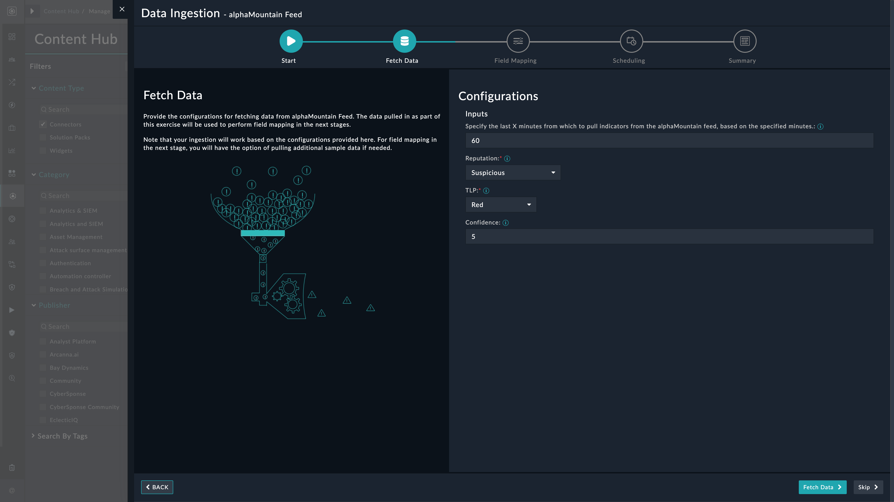
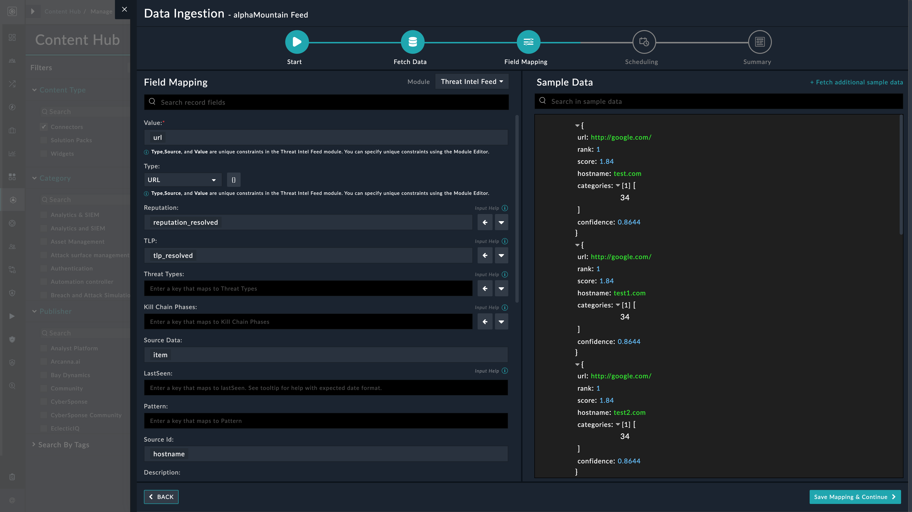

## About the connector
The AlphaMountain feed connector facilitates seamless integration with AlphaMountain's data sources, providing access to real-time and historical data on domain popularity, cybersecurity insights, risk scores and relevant content categorization and more.

This document provides information about the alphaMountain Feed Connector, which facilitates automated interactions, with a alphaMountain Feed server using FortiSOAR&trade; playbooks. Add the alphaMountain Feed Connector as a step in FortiSOAR&trade; playbooks and perform automated operations with alphaMountain Feed.

### Version information

Connector Version: 1.0.0

Authored By: Fortinet

Certified: No
## Installing the connector

Use the <strong>Content Hub</strong> to install the connector. For the detailed procedure to install a connector, click <a href="https://docs.fortinet.com/document/fortisoar/0.0.0/installing-a-connector/1/installing-a-connector" target="_top">here</a>.

You can also use the <code>yum</code> command as a root user to install the connector:

<pre>yum install cyops-connector-alphamountain-feed</pre>

## Prerequisites to configuring the connector
- You must have the credentials of alphaMountain Feed server to which you will connect and perform automated operations.
- The FortiSOAR&trade; server should have outbound connectivity to port 443 on the alphaMountain Feed server.

## Minimum Permissions Required
- Not applicable

## Configuring the connector
For the procedure to configure a connector, click [here](https://docs.fortinet.com/document/fortisoar/0.0.0/configuring-a-connector/1/configuring-a-connector)
### Configuration parameters

In FortiSOAR&trade;, on the Connectors page, click the <strong>alphaMountain Feed</strong> connector row (if you are in the <strong>Grid</strong> view on the Connectors page) and in the <strong>Configurations</strong> tab enter the required configuration details:

<table border=1><thead><tr><th>Parameter</th><th>Description</th></tr></thead><tbody><tr><td>Server URL</td><td>Specify the Rest API feed endpoint URL of the alphaMountain server to connect and perform automated operations.</td>
</tr><tr><td>API Key</td><td>Specify the API key to access the alphaMountain Rest API feed endpoint to which you will connect and perform the automated operations.</td>
</tr><tr><td>Verify SSL</td><td>Specifies whether the SSL certificate for the server is to be verified or not.  By default, this option is set to True.</td></tr>
</tbody></table>

## Actions supported by the connector
The following automated operations can be included in playbooks and you can also use the annotations to access operations:
<table border=1><thead><tr><th>Function</th><th>Description</th><th>Annotation and Category</th></tr></thead><tbody><tr><td>Get Indicators</td><td>Retrieves a list of all indicators from alphaMountain Feed. You can also filter the indicators retrieved from alphaMountain Feed based on the filter you have specified</td><td>get_indicators  Investigation</td></tr>
</tbody></table>

### operation: Get Indicators

#### Input parameters
<table border=1><thead><tr><th>Parameter</th><th>Description</th></tr></thead><tbody><tr><td>Start Date</td><td>Specify the date time for the beginning of the feed record to fetch. Due to internal synchronization between servers, recent record timestamps may be delayed by up to six hours and thus the latest timestamp used should be now() - '6 hours'
</td></tr><tr><td>Flags</td><td>Specify the list of flags to exclude certain types of entries from the results. Possible values include "Exclude IP","Exclude Host","Exclude Path","Exclude Dead".
</td></tr><tr><td>Minimum Risk</td><td>Specify a minimum risk score to include in the feed. Defaults to license entitlements
</td></tr><tr><td>Maximum Risk</td><td>Specify a maximum risk score to include in the feed. Defaults to license entitlements
</td></tr><tr><td>Include Categories</td><td>If you check this option, it will fetch newly classified and revalidated categorizations for retrieved feed indicators.
 <strong>If you choose 'true'</strong><ul><li>Categories: Specify a only list of categories to include in the returned feed. Defaults to license entitlements</li></ul></td></tr><tr><td>Include Popularity</td><td>If you check this option, it will fetch host popularity rankings for retrieved feed indicators.
</td></tr><tr><td>Limit</td><td>Specify a limit on the number of records returned. Defaults to license entitlements
</td></tr></tbody></table>

#### Output
The output contains the following populated JSON schema:

<pre>[
    {
        "url": "",
        "hostname": "",
        "score": "",
        "categories": [],
        "confidence": "",
        "rank": ""
    }
]</pre>
### Data Ingestion Support
Use the Data Ingestion Wizard to easily ingest data into FortiSOAR™ by pulling Threat Intelligence Feeds from alphaMountain Feed. Currently, Threat Intelligence Feeds ingested from alphaMountain Feed is mapped to Indicators in FortiSOAR™. For more information on the Data Ingestion Wizard, see the Connectors Guide in the FortiSOAR™ product documentation.

NOTE: For the ingestion playbooks to work you must install and configure the <a href="https://fortisoar.contenthub.fortinet.com//detail.html?entity=threat-intel-management&version=1.2.0&type=solutionpack">Threat Intel Management</a>
 Solution Pack on your FortiSOAR™ instance. For more information on solution packs see the respective solution pack document on the Content Hub Portal.

#### Configure Data Ingestion
You can configure data ingestion using the Data Ingestion Wizard to seamlessly map the incoming alphaMountain Feed Threat Intelligence Feeds to FortiSOAR™'s Indicators.

The Data Ingestion Wizard helps you to configure the scheduled pulling of data from alphaMountain Feed into FortiSOAR™. It also lets you pull some sample data from alphaMountain Feed using which you can define the mapping of data between alphaMountain Feed and FortiSOAR™. The mapping of common fields is generally already done by the Data Ingestion Wizard; users are mostly required to only map any custom fields that are added to the alphaMountain Feed Threat Intelligence Feeds.

1. To begin configuring data ingestion, click Configure Data Ingestion on the alphaMountain Feed connector's Configurations page.

    Click Let's Start by fetching some data, to open the Fetch Sample Data screen.

    
    Sample data is required to create a field mapping between alphaMountain Feed data and FortiSOAR™. The sample data is pulled from connector actions or ingestion playbooks.

2. You can pull Threat Intelligence Feeds from alphaMountain Feed by selecting the reputation of the indicator object (choose between Good, Suspicious, Malicious, No Reputation Available, or TBD) that you want to retrieve from alphaMountain. Additionally, you can also specify filters such as the confidence level of the indicator object, the TLP set for the object, and the age of the feed.
    The fetched data is used to create a mapping between the Threat Intelligence Feeds from alphaMountain Feed and FortiSOAR Indicators. Once you have completed specifying the configurations, click Fetch Data.

     

3. On the Field Mapping screen, map the fields of the ingested Threat Intelligence Feeds alphaMountain Feed to the fields of a Indicators present in FortiSOAR™.
To map a field, click the key in the sample data to add the Jinja value of the field. For example, to map the confidence parameter of an ingested Threat Intelligence Feeds from alphaMountain Feed to the value parameter of a FortiSOAR™ Indicators, click the Value field and then click the url field to populate its keys:

    
    For more information on field mapping, see the Data Ingestion chapter in the Connectors Guide in the FortiSOAR™ product documentation. Once you have completed mapping the fields, click Save Mapping & Continue.

4. (Optional) Use the Scheduling screen to configure schedule-based ingestion, i.e., specify the polling frequency to alphaMountain Feed, so that the content gets pulled from the alphaMountain Feed integration into FortiSOAR™
On the Scheduling screen, from the Do you want to schedule the ingestion? drop-down list, select Yes.
In the Configure Schedule Settings section, specify the Cron expression for the schedule. For example, if you want to pull data from alphaMountain Feed every 5 minutes, click Every X Minute, and in the minute box enter */5. This means that the Threat Intelligence Feeds will be pulled from alphaMountain Feed every 5 minutes

    
Once you have completed scheduling, click Save Settings & Continue.

5. The Summary screen displays a summary of the mapping done, and it also contains links to the Ingestion playbooks. Click Done to complete the data ingestion and exit the Data Ingestion Wizard.
    

